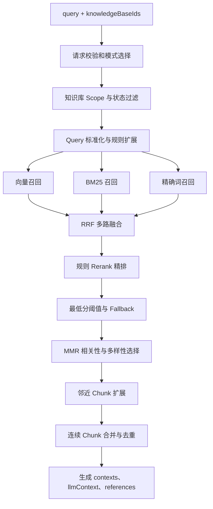

# 成员 B：RAG 检索策略与向量索引技术文档

## 1. 文档目的

本文档说明成员 B 负责的检索侧完整链路，包括：

- 知识库详情页关键词搜索与条件筛选。
- `DocumentSource` / `DocumentChunk` 到 RAG 检索领域模型的适配。
- Voyage Embedding 模型接入。
- 本地 `ChunkEmbedding` 向量表维护。
- chunk 新增、修改、删除时的向量一致性。
- Query 处理、多路召回、RRF 融合、规则精排、阈值过滤、MMR 去重。
- 邻近 chunk 扩展、上下文合并和引用来源返回。
- 简单向量 TopK 与当前混合检索策略的评测方案。

本文档重点不只是列出使用了哪些算法，而是说明：

```text
每一步解决什么问题
→ 为什么选择当前策略
→ 能带来什么收益
→ 需要承担什么成本和 Trade-off
```

> 分支说明：`zzy` 分支主要保存检索策略优化代码；Voyage、统一 `DocumentChunk`
> 数据适配和向量生命周期维护已进入后续集成版本。本文档描述最终集成后的完整设计。

## 2. 模块定位

RAG 全称是 Retrieval-Augmented Generation，即“检索增强生成”。

普通 LLM 对话链路是：

```text
用户问题
→ Agent 人设 Prompt
→ LLM 根据模型自身知识回答
```

加入 RAG 后，链路变为：

```text
用户问题
→ 从指定知识库检索相关内容
→ 组织为带引用的上下文
→ 将上下文交给 LLM
→ LLM 基于项目知识回答
```

因此，本模块是“普通 LLM 对话”与“基于企业知识库回答”之间的核心分界。

本模块的职责边界是：

- 上游负责导入文档、切分 chunk、AI 提炼和审核。
- RAG 负责向量索引、候选召回、融合、排序和上下文构建。
- 下游 Agent 只需要传入 query 和知识库范围，并消费返回的上下文与引用。

## 3. 整体架构

### 3.1 知识入库与索引链路


### 3.2 在线检索链路



## 4. 数据模型与可检索范围

### 4.1 数据模型适配

项目当前使用统一文档模型：

| 业务概念 | 当前模型 | 职责 |
| --- | --- | --- |
| 知识来源或文档 | `DocumentSource` | 保存文档信息、状态、来源和原文 |
| 可检索片段 | `DocumentChunk` | 保存原文 chunk 或 AI 提炼知识 |
| RAG 向量索引 | `ChunkEmbedding` | 保存 chunk 对应向量、模型和内容 hash |

RAG 内部会把 `DocumentChunk` 映射成统一的 `KnowledgeChunk` 类型，使检索算法不直接依赖 Prisma 表结构。

这样设计的收益：

- 数据库模型变化不会扩散到所有检索算法。
- Mock 数据和真实数据库可以共用检索流程。
- 后续替换向量数据库或 Embedding 模型时，对外接口保持稳定。

Trade-off：

- 增加了一层字段映射。
- 映射规则必须随着数据库字段变化同步维护。

### 4.2 可进入正式 RAG 的内容

正式检索只读取：

- 请求指定知识库绑定的文档。
- active 的知识库和文档绑定关系。
- `status = "parsed"` 且 `activeStatus = "active"` 的文档。
- `chunkStatus = "active"` 且正文非空的 chunk。
- 原文 `chunkType = "text"`。
- 或 `chunkType = "knowledge"` 且 `reviewStatus = "confirmed"` 的 AI 知识。

以下内容不会进入正式检索：

- pending 的 AI 候选知识。
- rejected 的 AI 候选知识。
- disabled 的文档或 chunk。
- 未解析完成的文档。
- 不属于请求知识库范围的内容。

设计收益：

- 防止跨知识库召回。
- 防止未经审核的 AI 内容污染回答。
- 将权限边界和知识质量控制放在检索最前面。

Trade-off：

- 状态字段维护错误会直接造成漏召回。
- 上游如果绕过 service 直接写 Prisma，可能产生状态或向量不一致。

## 5. 向量索引生命周期

### 5.1 Embedding 是什么

Embedding 是把文本转换成一组数字向量。语义相近的文本，其向量方向通常更接近。

例如：

```text
“如何给成员设置管理员权限”
“怎样为用户分配管理角色”
```

即使没有完全相同的词，也可能通过向量相似度互相匹配。

### 5.2 Voyage 接入

当前设计使用 Voyage Embeddings API：

```text
POST https://api.voyageai.com/v1/embeddings
```

默认模型：

```text
voyage-3.5
```

调用区分：

| 使用场景 | `input_type` |
| --- | --- |
| chunk 建库 | `document` |
| 用户 query | `query` |

区分 `document` 和 `query` 的原因是模型可以分别优化文档和问题在向量空间中的表示。

### 5.3 ChunkEmbedding

向量没有继续保存在业务表字段中，而是单独维护在 `ChunkEmbedding`：

| 字段 | 用途 |
| --- | --- |
| `chunkId` | 关联 `DocumentChunk.id` |
| `embedding` | JSON 序列化后的向量 |
| `embeddingModel` | 标识向量所属模型 |
| `contentHash` | 判断 chunk 内容是否已经变化 |
| `updatedAt` | 记录向量更新时间 |

设计收益：

- 业务数据与检索索引解耦。
- 可以判断向量是否过期。
- 后续更换模型时可以重新索引。
- 删除 chunk 时能够精确清理向量。

Trade-off：

- SQLite JSON 向量适合训练营和中小数据，不适合大规模 ANN 检索。
- 当前余弦相似度在应用内存中计算，chunk 数量大时性能会下降。

### 5.4 增删改一致性

| 业务操作 | 向量维护行为 |
| --- | --- |
| 新增 text chunk | 计算向量并写入 `ChunkEmbedding` |
| 修改 chunk 内容 | 重新计算并覆盖向量 |
| 删除 chunk | 删除对应向量 |
| 替换文档内容 | 删除旧 chunks 和旧向量，再写新 chunks 和新向量 |
| 删除文档 | 批量删除文档下所有 chunk 向量 |
| AI 候选确认 | 先生成向量，成功后再标记 confirmed / active |
| AI 候选驳回 | 删除向量并禁用 |

核心原则：

```text
可检索的 active chunk 应当拥有与当前内容匹配的 fresh embedding。
```

其中 `contentHash` 用于检查：

```text
当前 chunk 索引文本 hash
是否等于
ChunkEmbedding.contentHash
```

如果不相等，该向量会被视为过期，不参与向量召回。

### 5.5 同步索引的取舍

当前采用同步向量化：

```text
写入 chunk
→ 调用 Embedding API
→ 保存向量
→ 激活 chunk
```

收益：

- 一旦 chunk 进入 active，就可以确定它具备可用向量。
- 数据和索引一致性容易保证。
- 训练营项目实现简单、行为明确。

代价：

- 入库耗时会受到外部 API 延迟影响。
- API 失败会影响入库成功状态。
- 大批量文档不适合同步处理。

后续生产化可以改成：

```text
写入 chunk
→ 标记 indexing
→ 异步任务生成向量
→ 成功后标记 indexed / active
→ 失败重试并记录错误
```

## 6. 在线检索策略

## 6.1 请求校验与检索模式

调用方请求示例：

```json
{
  "query": "如何配置管理员权限？",
  "scope": {
    "knowledgeBaseIds": ["kb_xxx"]
  },
  "mode": "balanced"
}
```

支持三种模式：

| 模式 | 最终 TopK | 邻近扩展 | 使用场景 |
| --- | ---: | --- | --- |
| `fast` | 3 | 不扩展 | 低延迟、快速预览 |
| `balanced` | 5 | 适量扩展 | 默认问答 |
| `detailed` | 8 | 更多扩展 | 需要较完整证据 |

设计收益：

- 调用方不需要接触大量底层参数。
- 使用一个稳定模式表达速度与上下文完整度偏好。

Trade-off：

- 模式仍然是固定配置，不能适配所有 query。
- detailed 会增加上下文长度和处理时间。

## 6.2 Query 标准化

系统会先处理用户原始问题：

- trim 首尾空白。
- 压缩重复空格。
- 统一常见中英文标点。
- 去除部分不影响语义的问句后缀。

例如：

```text
“如何配置管理员权限？？”
→ “如何配置管理员权限”
```

收益：

- 降低无意义字符对关键词匹配的影响。
- 保证同一个问题的不同标点写法得到更稳定结果。

Trade-off：

- 标准化必须保守，过度清理可能改变业务含义。

## 6.3 Query Expansion：查询扩展

Query Expansion 是在保留原始问题的同时，生成少量同义检索问题。

例如：

```text
原始 Query：如何给成员配置管理员权限？
标准化 Query：如何给成员配置管理员权限
扩展 Query：怎么给用户设置管理员角色
扩展 Query：怎样给账号分配权限
```

当前扩展围绕：

- `怎么 / 怎样 / 如何`
- `配置 / 设置 / 分配 / 修改`
- `权限 / 角色 / 管理员`
- `成员 / 用户 / 账号`
- `删除 / 移除 / 禁用`

处理方式不是用改写结果替换原问题，而是：

```text
原始 Query
+ 标准化 Query
+ 最多 4 条规则扩展 Query
→ 每条 Query 分别进行多路召回
```

收益：

- 减少用户表达和文档措辞不同导致的漏召回。
- 保留原始 query，避免改写偏离原意。
- 规则方案无额外模型费用，输出稳定且可解释。

Trade-off：

- Query 数量增加后，Embedding API 调用次数和召回计算量增加。
- 固定同义词规则覆盖范围有限。
- 不合适的扩展可能带来噪声。

当前预留了 LLM Query Rewrite，但默认关闭。

选择规则扩展而非默认开启 LLM Rewrite，是因为：

- 交付期优先保证稳定性。
- 避免增加 LLM 调用费用和延迟。
- 避免模型改写改变用户原始意图。

## 6.4 多路召回概念

“召回”是先从全部知识中选出一批可能相关的候选，不要求这一步的顺序完全准确。

当前每条 retrieval query 都会执行：

```text
向量召回
+ BM25 召回
+ 精确词召回
```

每一路最多保留：

```text
最终 TopK × candidateMultiplier
```

当前 `candidateMultiplier = 4`。

例如 balanced 模式最终需要 Top5，每一路会先保留最多 20 条候选，让后续融合和重排有足够选择空间。

Trade-off：

- 候选池越大，召回覆盖率通常越高。
- 候选池越大，融合、精排和 MMR 成本也越高。

## 6.5 向量召回

流程：

```text
retrieval query
→ Voyage query embedding
→ 读取 fresh ChunkEmbedding
→ 计算余弦相似度
→ 按相似度降序排列
```

余弦相似度用于比较两个向量方向是否接近：

```text
越接近 1：语义越相似
接近 0：相关性较弱
```

向量召回解决：

- 用户与文档用词不同但含义接近。
- 自然语言改写和口语表达。
- 无法通过完全关键词匹配发现的语义关系。

收益：

- 提高语义召回能力。
- 对同义表达更友好。

Trade-off：

- 依赖外部 Embedding API。
- 有调用费用和网络延迟。
- 对短专有名词、编号、文件名不一定稳定。
- 当前内存遍历全部候选向量，规模增大后需要向量数据库。

## 6.6 BM25 召回

BM25 是经典的关键词相关性算法，主要考虑：

- 查询词是否出现在 chunk 中。
- 查询词在当前 chunk 出现多少次。
- 查询词在全部 chunks 中是否稀有。
- chunk 长度是否过长。

字段权重：

```text
标题 > 摘要 > 正文
```

中文当前使用轻量 n-gram 分词，例如：

```text
管理员权限
→ 管理、理员、员权、权限
```

BM25 解决：

- 产品名、权限名、角色名等专有词。
- API 名称、英文标识符、编号。
- 关键词明确但语义模型排序不稳定的情况。

收益：

- 无外部模型调用费用。
- 对明确关键词和稀有词非常有效。
- 算法可解释。

Trade-off：

- 无法理解真正的同义表达。
- 中文轻量分词不如成熟搜索引擎的分词器精确。
- 每次在候选集上计算，数据量大时需要倒排索引。

## 6.7 精确词召回

精确词召回会对以下字段执行加权匹配：

- 标题。
- 摘要。
- 正文。
- Metadata。

主要规则：

- 标题权重最高。
- 完整短语命中额外加分。
- 英文标识符、数字和较长中文词可获得更稳定匹配。

精确词召回解决：

- 文件名、角色名、产品名等短词容易被向量结果冲淡。
- 用户明确输入完整标题时，结果应当优先返回。
- Metadata 中包含关键来源信息，但正文未直接出现。

收益：

- 明确命中结果稳定。
- 容易解释为什么某条结果排在前面。

Trade-off：

- 字面相同不一定代表语义相关。
- 关键词重复较多的文本可能获得过高分。
- 必须由后续融合和精排控制噪声。

## 6.8 为什么组合三路召回

单一检索器有明显短板：

| 检索器 | 擅长 | 短板 |
| --- | --- | --- |
| 向量检索 | 语义相似、同义表达 | 专有词和短词可能不稳定 |
| BM25 | 稀有关键词、产品名、角色名 | 不理解真正的语义近似 |
| 精确词 | 标题和完整短语命中 | 容易产生字面匹配噪声 |

组合思路：

```text
向量负责“意思相近”
BM25 负责“关键词相关”
精确词负责“明确命中”
```

目标不是让三个检索器互相替代，而是让它们覆盖不同类型的问题。

## 6.9 RRF：倒数排名融合

RRF 全称 Reciprocal Rank Fusion，即倒数排名融合。

三路检索的原始分数不能直接比较：

- 向量召回使用余弦相似度。
- BM25 使用关键词相关性分数。
- 精确词召回使用字段加权分数。

RRF 不比较原始分数，只使用每一路中的排名：

```text
RRF score = 1 / (K + rank)
```

当前：

```text
K = 60
```

示例：

```text
Chunk A：向量第 2、BM25 第 3、精确词第 1
Chunk B：只在向量检索中排第 1
```

Chunk A 会累计三路排名贡献，因此通常会超过只被一路认可的 Chunk B。

RRF 解决：

- 不同检索器分数不可比。
- 同一 chunk 被多路召回时需要去重。
- 多种检索器共同认可的结果应当更靠前。

收益：

- 实现简单、稳定。
- 不需要人工把余弦分数和 BM25 分数归一到同一尺度。
- 对某一路分数异常不敏感。

Trade-off：

- 只关注排名，忽略原始分数差距。
- 排名第 1 是明显高分还是勉强高分，在 RRF 中区别不大。
- `K` 参数会影响头部排名贡献强度。

## 6.10 Rerank：规则精排

Rerank 是对召回候选重新排序。

当前没有调用独立付费 Reranker 模型，而是使用可解释的规则精排。

规则包括：

- 标题命中权重最高。
- 摘要命中权重次之。
- 正文和 Metadata 命中加权。
- exact 来源和 hybrid 多路命中结果加权。
- 判断 query 属于操作、概念或权限意图。
- 根据意图给合适的 chunk 类型加权。
- 当内容更新时间差异明显时，给较新内容轻量加权。

最终分数：

```text
70% RRF 基础分
+ 30% 规则 Boost 分
```

规则精排解决：

- RRF 不知道标题命中比正文偶然出现更重要。
- RRF 不理解问题意图和 chunk 类型。
- 多路共同命中的结果需要轻量增强。

收益：

- 不需要额外模型费用。
- 延迟低。
- 每项加权都可以解释。
- 适合训练营交付和规则明确的业务。

Trade-off：

- 规则需要人工维护。
- 对新领域的泛化能力不如模型 reranker。
- 权重目前属于工程初始值，仍需要 evalset 校准。

为什么当前不接模型 Reranker：

- 避免增加一次模型请求和 P95 延迟。
- 避免增加 API 费用和外部服务依赖。
- 当前数据规模和交付时间下，规则方案更可控。

## 6.11 最低分阈值与 Fallback

规则精排后进行相关性过滤：

```text
score >= 0.2
→ 正常保留
```

如果全部低于正常阈值：

```text
top1 score >= 0.05
→ 保留 top1，并标记 fallback
```

如果 top1 仍低于 `0.05`：

```text
返回空上下文
```

Fallback 表示“结果不够达到正常标准，但仍有一条勉强相关结果可以降级使用”。

阈值策略解决：

- RAG 为了强行返回内容而引入无关知识。
- 无关上下文误导 LLM，产生错误引用。
- 下游无法区分正常结果和低置信度结果。

收益：

- 控制错误召回。
- 支持无相关知识时明确返回空。
- Fallback 信息可以供下游决定是否使用。

Trade-off：

- 阈值过高会漏召回。
- 阈值过低会引入噪声。
- 当前阈值仍需要通过真实 evalset 校准。

## 6.12 MMR：最大边际相关性

MMR 全称 Maximal Marginal Relevance，即最大边际相关性。

普通 TopK 只关注相关性，可能返回：

```text
Top1：文档 A 第 1 段
Top2：文档 A 第 2 段
Top3：文档 A 第 3 段
Top4：文档 A 第 4 段
```

这些结果虽然相关，但可能表达相同内容，浪费上下文预算。

MMR 每次选择候选时同时考虑：

```text
与 query 的相关性
-
与已经选择结果的重复度
```

当前可以理解为：

```text
MMR = 70% 相关性 - 30% 重复度
```

MMR 解决：

- TopK 被同一篇文档的相似 chunks 占满。
- 有限上下文无法覆盖更多证据。
- 重复内容增加 LLM 输入成本。

收益：

- 提高结果多样性。
- 降低重复率。
- 在相近相关性下优先提供新信息。

Trade-off：

- 可能牺牲少量纯相关性。
- 依赖 chunk embedding 判断重复度。
- `lambda` 设置过低会过度追求多样性。

## 6.13 邻近 Chunk 扩展

MMR 选择出的核心命中 chunk 称为 Anchor Chunk，即锚点 chunk。

系统会围绕 anchor 补充前后相邻 chunk：

```text
前一个 Chunk
← Anchor Chunk →
后一个 Chunk
```

设计原因：

- 小 chunk 更容易精确召回。
- 但单个小 chunk 可能缺少定义、前提或后续步骤。
- 先用小 chunk 精确定位，再补相邻内容，可以兼顾精度和完整性。

不同模式：

| 模式 | 扩展策略 |
| --- | --- |
| `fast` | 不扩展 |
| `balanced` | 前后适量扩展，最多补 4 个 |
| `detailed` | 允许补更多，最多补 8 个 |

相邻 chunk 的分数会按距离衰减，避免它超过真正命中的 anchor。

收益：

- 提升上下文连续性。
- 减少“只召回半句话”的情况。
- 更适合步骤说明和长文档。

Trade-off：

- 增加上下文长度。
- 邻居可能包含与 query 无关的内容。
- 扩展过多会挤占其他证据的预算。

## 6.14 Context Builder：上下文构建

最后一步不是直接把 chunks 原样返回，而是进行：

- 按 `chunkId` 最终去重。
- 按知识库和来源文档分组。
- 合并同一文档中 `chunkIndex` 连续的 chunks。
- 删除相邻文本之间的 overlap 重复内容。
- 约束总上下文不超过 6000 字符。
- 为每个上下文块生成 `[ref_1]`、`[ref_2]` 引用编号。
- 保留合并前的来源 chunk IDs。

返回：

```ts
{
  query,
  contexts,
  llmContext,
  references,
  metrics
}
```

字段说明：

| 字段 | 用途 |
| --- | --- |
| `contexts` | 下游结构化处理、展示检索结果 |
| `llmContext` | 可以直接拼入 LLM Prompt |
| `references` | 把回答引用映射回来源 chunk |
| `metrics` | 返回阈值过滤和 fallback 信息 |

收益：

- LLM 获得更连续、去重后的内容。
- 前端可以展示可追溯引用。
- 避免上下文无限增长。

Trade-off：

- 当前按字符而不是 tokenizer 控制预算，token 数不够精确。
- 合并过多内容可能降低上下文密度。

## 7. 策略组合总结

整套策略按阶段解决不同问题：

| 阶段 | 核心目标 |
| --- | --- |
| Scope / 状态过滤 | 保证数据范围和知识质量正确 |
| Query 扩展 | 降低用户表达差异造成的漏召回 |
| 向量 + BM25 + Exact | 提高候选覆盖率 |
| RRF | 统一不可直接比较的多路结果 |
| 规则 Rerank | 利用字段和业务意图提高排序质量 |
| MinScore / Fallback | 控制无关结果和低置信度结果 |
| MMR | 减少重复、增加证据多样性 |
| 邻近扩展 | 补充局部上下文 |
| Context Builder | 合并、去重、限长并生成引用 |

核心设计思想：

> 召回阶段优先扩大覆盖面，排序阶段逐步收敛相关性，最后通过去重和上下文构建控制交给 LLM 的信息质量。

## 8. 对外接口

接口：

```http
POST /api/rag/retrieve
```

推荐请求：

```json
{
  "query": "如何配置管理员权限？",
  "scope": {
    "knowledgeBaseIds": ["kb_xxx"]
  },
  "mode": "balanced"
}
```

对下游隐藏：

- Embedding 模型。
- 向量维度。
- BM25 权重。
- RRF 参数。
- Rerank 权重。
- MMR 参数。
- 上下文扩展窗口。

这样做的原因是检索参数属于服务端策略，不应由每个 Agent 随意传入，否则不同调用方会产生不可控的检索质量。

## 9. 关键词搜索与筛选组件

知识库详情页的搜索框不是 RAG，而是管理端关键词搜索。

搜索字段：

- `DocumentSource.title`
- `DocumentSource.fileName`
- `DocumentSource.originalName`
- `DocumentChunk.title`
- `DocumentChunk.content`

筛选字段：

- `DocumentChunk.chunkType`
- `DocumentChunk.reviewStatus`
- `DocumentChunk.suggestedCategory`
- `DocumentChunk.suggestedTags`

区别：

| 能力 | 用途 | 是否调用向量模型 |
| --- | --- | --- |
| 详情页搜索 | 用户管理和定位知识 | 否 |
| 详情页筛选 | 按 chunk 元数据缩小展示范围 | 否 |
| RAG 检索 | 为 Agent / LLM 找上下文 | 是 |

## 10. 异常与降级

### 10.1 Embedding API 失败

当前集成版本对 chunk 建库增加了外部 Embedding provider 的失败处理和重试。

需要重点保证：

- Query 和 chunk 必须使用相同模型、相同维度和同一向量空间。
- 不同 provider 生成的向量不能直接做余弦相似度比较。
- 如果 chunk 建库降级到其他模型，query 也必须使用同模型生成向量。

当前风险：

> chunk 建库存在 Voyage 失败后使用其他 provider 的降级逻辑，但 query 默认仍走 Voyage。
> 如果两个 provider 的模型或维度不同，该批 chunk 将无法正常参与向量召回。

推荐改进：

- `ChunkEmbedding.embeddingModel` 保存 provider 和模型。
- 检索时按模型分组生成 query embedding。
- 或者不跨 provider 降级，失败时保持 indexing / disabled 并重试。

### 10.2 向量缺失或过期

- 缺失向量的 chunk 不参与 vector 召回。
- `contentHash` 不一致的过期向量不参与 vector 召回。
- BM25 和精确词召回仍可以提供关键词通道。

这种设计保证检索时不会同步重建大量 chunk 向量，避免查询延迟不可控。

## 11. 效果评测方案

为了证明当前策略相对简单向量 TopK 的收益，建议进行 A/B 离线评测。

### 11.1 对比策略

Baseline：

```text
原始 Query
→ 单路向量召回
→ 直接返回 Top5
```

Current：

```text
Query 扩展
→ 向量 + BM25 + Exact
→ RRF
→ 规则 Rerank
→ 阈值
→ MMR
→ 邻近扩展
```

### 11.2 建议指标

| 指标 | 含义 | 主要验证内容 |
| --- | --- | --- |
| `Hit@5` | Top5 是否至少命中一个正确 chunk | 能不能搜到 |
| `Recall@5` | Top5 覆盖了多少正确证据 | 召回是否完整 |
| `MRR@5` | 第一个正确结果的倒数排名 | 正确结果是否靠前 |
| `Average Latency` | 平均检索耗时 | 日常性能 |
| `P95 Latency` | 95% 请求能在多长时间内完成 | 尾延迟和稳定性 |
| `Duplicate Rate` | 返回结果内容重复比例 | MMR 是否有效 |
| `Scope Violation Rate` | 是否返回知识库范围外结果 | 数据边界正确性 |
| `Fresh Embedding Coverage` | 可检索 chunk 中 fresh 向量比例 | 索引健康度 |

### 11.3 Evalset 格式

```json
{
  "id": "permission_001",
  "query": "如何给成员配置管理员权限？",
  "scope": {
    "knowledgeBaseIds": ["kb_xxx"]
  },
  "expectedChunkIds": ["chunk_a", "chunk_b"],
  "note": "应命中权限配置说明"
}
```

建议最少覆盖：

- 精确关键词问题。
- 语义改写问题。
- 原文 text chunk 问题。
- AI knowledge chunk 问题。
- 多证据问题。
- 相似干扰问题。
- 跨知识库范围问题。
- 无相关知识问题。

### 11.4 当前评测状态

当前代码已预留 Hit@K、Recall@K、MRR@K 和平均耗时的离线评测结构。

本次交付应如实说明：

> 当前优先完成检索链路、向量索引维护和上下游联调闭环，尚未基于真实业务问题集完成系统性效果评测。现有阈值和规则权重属于工程初始值，后续需要通过 evalset 校准。

不应在没有真实数据时编造策略提升百分比。

## 12. 当前方案的总体 Trade-off

| 当前选择 | 收益 | 代价 |
| --- | --- | --- |
| Voyage Embedding | 具备真实语义召回能力 | API 成本和网络依赖 |
| SQLite 保存向量 | 交付简单、便于本地运行 | 不适合大规模向量检索 |
| 内存余弦计算 | 实现直接、结果可控 | chunk 数量增大后性能下降 |
| 规则 Query Expansion | 稳定、免费、可解释 | 覆盖范围有限 |
| 三路混合召回 | 提高语义与关键词覆盖 | 计算量和复杂度增加 |
| RRF | 无需统一不同分数尺度 | 忽略原始分数差距 |
| 规则 Rerank | 无模型费用、低延迟 | 泛化能力弱于模型 Reranker |
| MinScore + Fallback | 降低错误召回 | 阈值需要真实评测校准 |
| MMR | 降低重复率 | 可能牺牲少量纯相关性 |
| 邻近扩展 | 补齐上下文 | 可能引入噪声 |
| 字符预算 | 实现轻量 | token 控制不精确 |
| 同步向量化 | 数据索引一致性强 | 入库受外部 API 影响 |

## 13. 后续生产化方向

按优先级建议：

1. 建立 20-50 条真实 evalset，对比向量 TopK 和混合检索。
2. 补充 P95 延迟、Duplicate Rate、索引覆盖率。
3. 统一 Voyage 与备用 provider 的向量空间。
4. 将向量化改成异步任务并增加失败重试。
5. 使用 tokenizer 控制上下文预算。
6. 数据规模增大后接入支持 ANN 的向量数据库。
7. 有评测证据后再决定是否接入模型 Reranker。
8. 对 Query Expansion 规则做领域化配置或开启可控的 LLM Rewrite。

## 14. 会议讲解总结

会议上可以用下面这段话总结：

> 我负责的是检索侧完整闭环。上游文档解析或 AI 提炼后会形成
> `DocumentChunk`，我接入 Voyage 生成向量并维护独立的
> `ChunkEmbedding` 表，保证 chunk 新增、修改、删除时索引同步。
> 在线检索时，下游只传 query 和知识库范围。我先过滤不可用和未审核知识，
> 再保留原始 query 并生成少量规则同义 query，每条 query 同时进行向量、
> BM25 和精确词三路召回。三路结果通过 RRF 按排名融合，再使用规则
> Rerank、最低分阈值和 MMR 控制排序质量、错误召回和重复内容。
> 最后以命中 chunk 为锚点补充邻近上下文，合并连续 chunk、删除 overlap，
> 并生成可直接给 LLM 使用的 `llmContext` 和可追溯的 `references`。
> 这套方案的目标是在召回覆盖率、排序准确性、结果多样性、上下文完整性、
> 接口成本和交付稳定性之间取得平衡。

